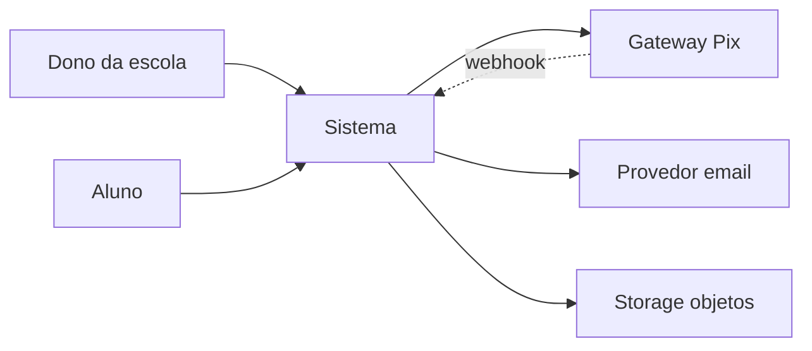
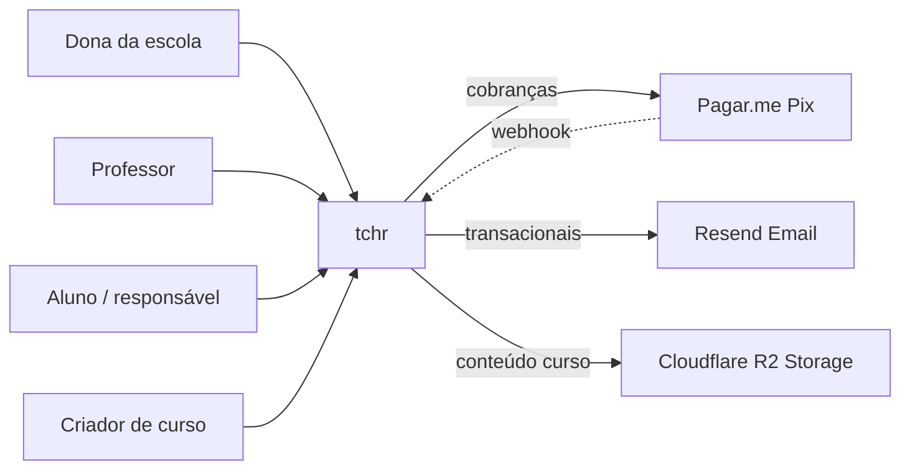
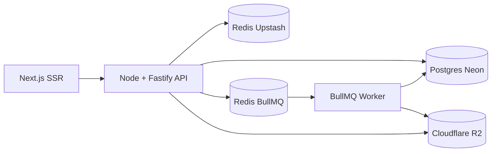

# Skill: `design-architecture`

> Define arquitetura de alto nível, integrações, dados, segurança, observabilidade, deploy e ambientes — depois da stack escolhida.

| Campo | Valor |
|-------|-------|
| Skill ID | `design-architecture` |
| Fase do fluxo | Fase 7 — arquitetura |
| Skill anterior | [`choose-stack`](07-choose-stack.md) |
| Skill seguinte | [`define-module-spec`](10-define-module-spec.md) |
| Tempo típico | 2–4 horas |

## Contexto e objetivo

Após escolher a stack, você ainda não tem arquitetura — tem componentes. Essa skill liga os pontos: como o sistema é desenhado em alto nível, como módulos conversam, como dados são modelados, como segurança permeia tudo, como observamos em produção e como fazemos deploy.

A skill produz **muitos documentos** — é a fase mais "pesada" em quantidade de escrita. Mas cada doc é curto e tem propósito específico.

A skill faz dez coisas:

1. **Esboça C4-lite** (Nível 1 — Contexto, Nível 2 — Containers, Nível 3 — Componentes para containers chave).
2. **Mapeia integrações externas** (gateway, email, SMS, storage, auth, monitoramento).
3. **Define estratégia de dados** (multi-tenancy, retenção, backups).
4. **Define estratégia de autenticação e autorização**.
5. **Define estratégia de eventos** (quem emite, quem consome, idempotência).
6. **Define estratégia de cache, fila e jobs assíncronos**.
7. **Define estratégia de observabilidade** (logs, métricas, traces, alertas, SLOs).
8. **Define estratégia de deploy** (rolling/canary/feature flag) e **ambientes**.
9. **Define requisitos de segurança** e **inventário inicial de PII**.
10. **Cria ≥ 3 ADRs estruturais** (deploy, banco, padrão arquitetural).

O que `design-architecture` **não faz**:

- Não escreve specs detalhadas de módulo (Fase 8).
- Não decide implementação interna de cada módulo.
- Não desenha telas.

## Quando você deve invocar

- Após [`choose-stack`](07-choose-stack.md) com ADR-0001 criado.
- Antes de [`define-module-spec`](10-define-module-spec.md).
- Quando arquitetura geral precisar de revisão (mudança de stack, marco de escala, incidente grave).

**Gatilhos no chat:**

- "vamos desenhar a arquitetura"
- "como estruturamos a parte de pagamentos e marketplace?"
- "precisamos de microserviços?"

## Pré-condições

- [ ] [`technology-decision.md`](../../../docs/architecture/technology-decision.md) preenchido.
- [ ] ADR-0001 (stack principal) existe em `docs/adr/`.
- [ ] [`docs/modules/`](../../../docs/modules/) com lista de módulos do MVP.
- [ ] [`mvp-scope.md`](../../../docs/product/mvp-scope.md) consolidado.
- [ ] (Recomendado) [`05-map-users.md`](05-map-users.md) já invocado para definir papéis.

## O passo a passo

### 1. Invoque a skill

> "vamos desenhar a arquitetura"

A IA lê os arquivos de pré-condição e começa pelo C4 nível 1.

### 2. C4 Nível 1 — Contexto

Diagrama de quem usa o sistema e com quem o sistema fala. A IA gera Mermaid:

A IA escreve em [`architecture-overview.md`](../../../docs/architecture/architecture-overview.md) e [`system-context.md`](../../../docs/architecture/system-context.md).

### 3. C4 Nível 2 — Containers

Mostra os blocos lógicos principais. Para a maioria dos projetos pequenos:

- Frontend Web (Next.js / Phoenix / etc.).
- API HTTP (backend principal).
- Worker assíncrono (fila + jobs).
- Banco principal (Postgres).
- Cache (Redis).
- Fila (BullMQ / Oban / RabbitMQ).
- Storage de objetos.

A IA atualiza `architecture-overview.md` com Nível 2 em Mermaid.

### 4. Defina multi-tenancy

Escolha entre 3 modelos:

- **Pool** (1 banco, `tenant_id` em todas as queries) — recomendado para começo.
- **Bridge** (schema por tenant) — quando isolamento aumenta.
- **Silo** (banco por tenant) — apenas enterprise/regulação.

A IA escreve a decisão em [`data-strategy.md`](../../../docs/architecture/data-strategy.md). Se a escolha não for pool, **gere ADR explicando**.

### 5. Defina estratégia de eventos

Para cada módulo (já definido em `plan-modules`):

- Eventos que emite (lista).
- Eventos que consome.
- Esquema preliminar (chaves + tipos básicos).
- Idempotência por chave (geralmente `event.id`).

A IA pode propor convenção `<modulo>.<acao_passada>` (ex.: `charge.succeeded`).

### 6. Defina cache, fila, jobs

Para cada um:

- **Cache:** o que vai cachear (sessão, configuração, dados quase imutáveis), TTL, invalidação por evento.
- **Fila:** quem produz, quem consome, idempotência, DLQ, alerta.
- **Jobs:** o que roda async (envio de email, geração de relatório, reconciliação noturna).

### 7. Defina integrações externas

Para cada serviço externo (do `integration-map.md` esboçado em `choose-stack`):

- Categoria (pagamento, email, etc.).
- Criticidade (alta/média/baixa).
- Fallback (existe? qual?).
- Custos estimados.
- Política de webhook (signing, idempotência).

A IA refina [`integration-map.md`](../../../docs/architecture/integration-map.md) e sugere criar `docs/specs/integrations/<servico>.md` para os críticos usando o `integration-spec-template.md`.

### 8. Defina segurança

A IA conduz preenchimento de:

- [`security-requirements.md`](../../../docs/security/security-requirements.md) — checklist mínimo por camada (aplicação, auth, dados, infra, pipeline, monitoramento, pagamento, LGPD).
- [`auth-strategy.md`](../../../docs/security/auth-strategy.md) — algoritmo de hash, MFA, sessões, tokens.
- [`data-privacy.md`](../../../docs/security/data-privacy.md) — inventário de PII, bases legais LGPD, direitos do titular.
- [`threat-model.md`](../../../docs/security/threat-model.md) — STRIDE simplificado, top 10 ameaças priorizadas.

Esta etapa é longa — 30–45 min — mas crítica. **Não pule**.

### 9. Defina observabilidade

A IA conduz:

- [`monitoring.md`](../../../docs/operations/monitoring.md) — RED por serviço, USE para infra, SLOs.
- [`logging.md`](../../../docs/operations/logging.md) — formato JSON, níveis, campos obrigatórios, sanitização de PII, retenção.
- [`incident-response.md`](../../../docs/operations/incident-response.md) — severidades, papéis, runbook básico, postmortem.
- [`observability-strategy.md`](../../../docs/architecture/observability-strategy.md) — pilares (logs/métricas/traces), ferramentas, cardinalidade.

### 10. Defina deploy e ambientes

- [`deployment-strategy.md`](../../../docs/deployment/deployment-strategy.md) — rolling/blue-green/canary, feature flags, migrações 2-fases.
- [`environments.md`](../../../docs/deployment/environments.md) — local/dev/staging/produção, isolamento, segredos.
- [`ci-cd.md`](../../../docs/deployment/ci-cd.md) — pipeline (lint → tipos → testes → segurança → build → deploy → smoke), DORA metrics.

### 11. Defina escalabilidade

[`scalability-strategy.md`](../../../docs/architecture/scalability-strategy.md):

- Capacidade alvo por horizonte (lançamento, 6m, 12m, 24m).
- Gargalos previstos por horizonte.
- Critério para introduzir réplica, partição, sharding, microserviço.

**Crítico:** registre o número que **justifica** introduzir cada complexidade. Sem número, é overengineering.

### 12. Crie ≥ 3 ADRs estruturais

Geralmente:

- ADR-0002 — Banco principal (Postgres por padrão; justifique alternativas avaliadas).
- ADR-0003 — Padrão arquitetural (monolito modular, microserviços, etc.).
- ADR-0004 — Estratégia de autenticação (própria, Clerk, Auth0).
- ADR-0005 — Modelo de multi-tenancy.

Invoque [`create-adr`](11-create-adr.md) para cada.

### 13. Atualize `PROJECT_STATE.md`

Marca Fase 7 ✅ e sugere [`define-module-spec`](10-define-module-spec.md).

## Perguntas que a mentora vai fazer

**1. Visão geral — qual o desenho de alto nível?**
Por que importa: mono / monolito modular / microserviços é decisão estruturante.

**2. Quais sistemas externos críticos?**
Por que importa: cada um vira ponto de falha potencial.

**3. Qual o modelo multi-tenant?**
Por que importa: muda o design de todas as queries.

**4. Quais eventos o sistema vai emitir?**
Por que importa: define como módulos se acoplam.

**5. Há jobs assíncronos importantes?**
Por que importa: fila + worker + DLQ + alerta — não esquecer DLQ.

**6. Como tratamos idempotência?**
Por que importa: cobrança, webhook, evento — sem idempotência, bug em qualquer retry.

**7. Qual o modelo de cache?**
Por que importa: invalidação é a parte difícil.

**8. Qual a estratégia de logs e métricas?**
Por que importa: sem isso, debugar em produção é adivinhação.

**9. Como deployamos?**
Por que importa: estratégia errada = downtime ou bug em produção.

**10. Quais ambientes existem?**
Por que importa: sem staging, você descobre bug em produção.

**11. Como tratamos segredos?**
Por que importa: segredo em código = vazamento esperando acontecer.

**12. Como tratamos backups e DR?**
Por que importa: RPO/RTO definidos = sobreviver a incidente.

**13. Quais requisitos LGPD impactam a arquitetura?**
Por que importa: LGPD afeta logs, retenção, exportação, exclusão.

## Documentos produzidos ou atualizados

| Arquivo | O que entra | Fonte |
|---------|-------------|-------|
| [`architecture-overview.md`](../../../docs/architecture/architecture-overview.md) | C4-lite níveis 1-3, padrões adotados/evitados, ADRs estruturais. | A IA + você. |
| [`system-context.md`](../../../docs/architecture/system-context.md) | Atores, sistemas externos, fluxos cross-domínio. | A IA. |
| [`integration-map.md`](../../../docs/architecture/integration-map.md) | Tabela mestra de integrações externas. | A IA. |
| [`data-strategy.md`](../../../docs/architecture/data-strategy.md) | Multi-tenancy, retenção, backups, migrações. | A IA. |
| [`scalability-strategy.md`](../../../docs/architecture/scalability-strategy.md) | Capacidade por horizonte, gargalos, SLOs. | A IA. |
| [`observability-strategy.md`](../../../docs/architecture/observability-strategy.md) | Pilares + ferramentas + cardinalidade. | A IA. |
| [`security-requirements.md`](../../../docs/security/security-requirements.md) | Checklist por camada. | A IA. |
| [`auth-strategy.md`](../../../docs/security/auth-strategy.md) | Hash, MFA, sessões, tokens. | A IA. |
| [`data-privacy.md`](../../../docs/security/data-privacy.md) | Inventário PII, bases legais, direitos do titular. | A IA. |
| [`threat-model.md`](../../../docs/security/threat-model.md) | STRIDE simplificado, top 10 ameaças. | A IA. |
| [`deployment-strategy.md`](../../../docs/deployment/deployment-strategy.md) | Rolling/canary, feature flags, rollback. | A IA. |
| [`environments.md`](../../../docs/deployment/environments.md) | dev/staging/prod, segredos. | A IA. |
| [`ci-cd.md`](../../../docs/deployment/ci-cd.md) | Pipeline, gates, DORA. | A IA. |
| [`monitoring.md`](../../../docs/operations/monitoring.md) | RED/USE, dashboards, alertas. | A IA. |
| [`logging.md`](../../../docs/operations/logging.md) | Formato, níveis, sanitização. | A IA. |
| [`incident-response.md`](../../../docs/operations/incident-response.md) | Severidades, runbook, postmortem. | A IA. |
| ADRs (mín. 3) | Banco, padrão arquitetural, auth, multi-tenancy. | Via [`create-adr`](11-create-adr.md). |

## Critérios de "terminei essa skill"

- [ ] C4 níveis 1 e 2 esboçados com Mermaid.
- [ ] Integrações externas registradas com criticidade e fallback.
- [ ] Multi-tenancy decidida e justificada.
- [ ] Eventos por módulo listados (sem schema final ainda).
- [ ] Cache, fila, jobs com decisões claras.
- [ ] Segurança coberta (requisitos, auth, privacidade, threat model).
- [ ] Observabilidade definida (logs, métricas, traces, alertas).
- [ ] Deploy e ambientes definidos.
- [ ] ≥ 3 ADRs estruturais criados.
- [ ] [`PROJECT_STATE.md`](../../../docs/PROJECT_STATE.md) mostra Fase 7 ✅.

## Anti-padrões — sinais de que algo está errado

🚫 **A IA recomendou microserviços sem volume justificável.** Lembre da rule `avoid-overengineering`. Padrão é monolito modular.

🚫 **"Vamos definir auth depois."** Não. Auth é da Fase 7. Atrasar = bug de permissão depois.

🚫 **Sem inventário de PII.** LGPD obriga. Sem isso, projeto não está pronto para produção em BR.

🚫 **SLO de 99.999% no MVP.** Irrealista. Comece em 99.5% e suba conforme infra amadurece.

🚫 **Cache definido sem estratégia de invalidação.** Vira bug latente. Toda invalidação precisa de teste.

🚫 **Fila sem DLQ.** Mensagens que falham consecutivamente vão pra onde? Defina DLQ + alerta.

🚫 **Webhook sem signing + sem idempotência.** Spoofable + processado N vezes. Falha previsível.

🚫 **Logs com PII (CPF, token).** LGPD + custo de armazenamento + risco. Sanitização central obrigatória.

🚫 **Backup sem teste de restore.** Backup que não restaura é teatro.

🚫 **Ambiente único (só produção).** Bug descoberto pelo usuário em vez de em staging.

## Exemplo aplicado: tchr

**C4 Nível 1:**

**C4 Nível 2:**

**Multi-tenancy:** pool (1 banco, `tenant_id` em todas as tabelas) — registrado em ADR-0005.

**Eventos principais:**
- `identity` → `user.created`, `tenant.suspended`.
- `school-management` → `class.created`, `student.enrolled`, `enrollment.cancelled`.
- `billing` → `charge.created`, `charge.succeeded`, `charge.failed`, `invoice.overdue`.
- `catalog` → `course.published`.
- `marketplace` → `order.created`, `payout.processed`.

Idempotência: `event_id` como chave em todos.

**Integrações críticas:**

| Serviço | Criticidade | Fallback |
|---------|-------------|----------|
| Pagar.me (Pix) | alta | Asaas |
| Resend (email) | média | SES |
| Cloudflare R2 | alta | sem fallback (lock-in aceito) |
| Sentry | média | logs estruturados |

**Auth:**
- Hash: argon2id.
- Sessão: access token JWT 15min + refresh token rotacionável 30d.
- MFA: opcional para usuários comuns, obrigatório para admin e papéis financeiros.
- Multi-tenancy: `tenant_id` em todo token + middleware obrigatório que valida em toda query.

**Observabilidade:**
- Logs: JSON estruturado, sanitizer central, retenção 30d (auditoria 7 anos).
- Métricas: OpenTelemetry → Grafana Cloud free tier. RED por endpoint + métricas de negócio (cobranças geradas, vendas no marketplace).
- Traces: 100% em dev, 10% em produção, 100% para erros.
- SLO: 99.5% disponibilidade, p95 < 300ms em rotas críticas, 99% sucesso de cobrança.

**Deploy:**
- Rolling deploy em Railway.
- Feature flag via flag local em Postgres (ferramenta externa quando crescer).
- Migrações expand → backfill → contract.

**Ambientes:**
- local (sintético).
- preview (branch).
- staging (espelho de produção, dados sintéticos).
- production (dados reais).

**Segredos:** Railway secrets gerenciados.

**Backups:** Neon snapshot diário + WAL. RPO 5min, RTO 30min.

**ADRs criados:**
- ADR-0002: Postgres como banco primário.
- ADR-0003: Monolito modular (não microserviços no MVP).
- ADR-0004: Auth próprio com argon2 + JWT.
- ADR-0005: Multi-tenancy pool.

## Troubleshooting

### A IA pulou segurança porque "é detalhe"

Não é. Volte: "preencha `security-requirements.md` integralmente — checklist por camada". A rule `security-by-design` cobre.

### Tenho muita integração externa

Liste todas em `integration-map.md`, mas no MVP **escolha o mínimo viável** (1 gateway, 1 email, 1 storage). Adicionar provedor depois é cheap; remover é caro.

### Multi-tenancy: silo me parece mais seguro

Custo operacional explode. Comece pool. Mude para bridge ou silo quando regulação ou enterprise exigir, **com ADR explicando**.

### Sentry/Datadog está fora do orçamento

Comece com OpenTelemetry → Grafana Cloud free tier + Sentry free tier (5k erros/mês). Suficiente para MVP.

### Não consigo decidir entre BullMQ e RabbitMQ

Critério simples: stack Node + Redis disponível? BullMQ. Stack Elixir? Oban. Múltiplas linguagens + alto volume? RabbitMQ. Sem complexidade? BullMQ basta para MVP de quase tudo.

### Backup com RTO/RPO definido mas nunca testei restore

Crie tarefa no roadmap: "testar restore mensal". Game day quando time tiver maturidade.

## Próximo passo

➡️ **[`define-module-spec`](10-define-module-spec.md)** — para cada módulo crítico, escrever spec completa.

## Referências cruzadas

- [`.claude/skills/design-architecture/SKILL.md`](../../../.claude/skills/design-architecture/SKILL.md) — arquivo consumido pela IA.
- [`.genesis/tests/skills/design-architecture.md`](../../tests/skills/design-architecture.md) — checks canônicos.
- Rules relevantes:
  - [`security-by-design`](../../../.claude/rules/security-by-design.md)
  - [`avoid-overengineering`](../../../.claude/rules/avoid-overengineering.md)
  - [`documentation-first`](../../../.claude/rules/documentation-first.md)
- Agents relevantes:
  - [`software-architect`](../../../.claude/agents/software-architect.md) — revisão geral.
  - [`security-reviewer`](../../../.claude/agents/security-reviewer.md) — para auth/PII/LGPD.
  - [`scalability-reviewer`](../../../.claude/agents/scalability-reviewer.md) — para SLO/cache/fila.
- Templates relevantes:
  - [`adr-template.md`](../../templates/adr-template.md) — para ADRs estruturais.
  - [`integration-spec-template.md`](../../templates/integration-spec-template.md) — para detalhar cada integração crítica.
  - [`data-model-template.md`](../../templates/data-model-template.md) — para modelar entidades nos specs.
