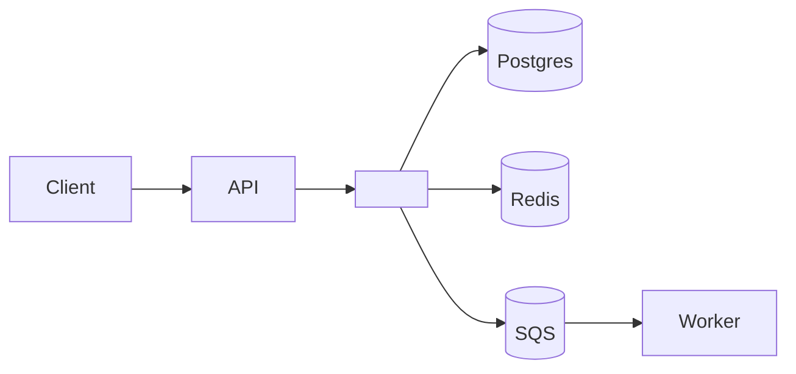

# Runbook: <nome-do-modulo>

> Aplicado pela skill `ops-define-runbook`. Vivo: atualizado em cada postmortem ou mudança arquitetural.

## Identificação

- **Módulo**: <nome>
- **Owner**: <squad + lead>
- **Oncall rotation**: <link pra PagerDuty/Opsgenie>
- **Última revisão**: <YYYY-MM-DD por NOME>
- **Próxima revisão**: <YYYY-MM-DD>

## Propósito

<1 parágrafo: o que esse módulo faz, qual valor entrega ao user/sistema.>

## Arquitetura resumida



## Dependências

### Upstream (quem chama este módulo)

| Caller | Endpoint/evento | SLA esperado |
|--------|----------------|--------------|
| `api-gateway` | `POST /charges` | p95 < 300ms |
| Webhook Stripe | `event.processed` | p99 < 1s |

### Downstream (quem este módulo chama)

| Dependência | Tipo | Critically | Comportamento em falha |
|-------------|------|:----------:|------------------------|
| Postgres | banco | crítico | retry exponencial, circuit breaker |
| Stripe API | externa | crítico | retry + fallback queue |
| Sendgrid | externa | médio | best-effort, registra em DLQ |

## SLO/SLI atual

| SLI | Target | Janela | Fonte |
|-----|--------|--------|-------|
| Disponibilidade | 99.5% | 30 dias | `http_requests_total{module="X",status!~"5.."}` |
| Latência p95 | < 500ms | 7 dias | `http_request_duration_seconds_bucket` |

Error budget atual: <X% restante>.

## Alertas associados

| Alerta | Threshold | Severidade | Ação imediata |
|--------|-----------|:----------:|---------------|
| `Module5xxRate` | error rate > 5% por 5min | P1 | seguir "Procedimento de incidente P1" |
| `ModuleLatencyHigh` | p95 > 800ms por 10min | P2 | verificar dashboard de latência, identificar query lenta |
| `ModuleQueueBacklog` | queue size > 10k | P2 | escalar worker ou investigar bottleneck |

Cada alerta linka pra este runbook.

## Procedimentos comuns

### Deploy

```bash
# 1. Confirmar CI verde
gh run list --workflow=ci.yml --limit=1

# 2. Deploy via CD (auto após merge)
# Verificar em <link pro dashboard CD>

# 3. Validar canary 10%
# Esperar gate automático (5min) ou validar manualmente
```

### Rollback

```bash
# Opção 1: feature flag (instantâneo, sem redeploy)
<comando do flag provider>

# Opção 2: redeploy versão anterior
<comando do CD>

# RTO target: ≤ 5min
```

### Restart graceful

```bash
<comando do orquestrador>
# Esperar drain (max 30s)
# Validar healthcheck
```

### Scale up/down

```bash
# Métrica de gatilho
<comando>
# Validar load distribuído
```

### Debug comum

1. **Erro 500 espalhado**: verificar `service.errors{module="X"}`. Se >5%, escalar.
2. **Latência alta**: verificar trace exemplares. Buscar span lento.
3. **Queue backlog**: verificar throughput do worker + erros recentes.
4. **Memory leak suspeita**: heap dump + comparar com baseline.
5. **Outra dep down**: verificar dashboard da dep + considerar circuit breaker manual.

## Procedimentos de incidente

### P1 (caminho de receita parado)

1. Declarar incidente: `/incident open` no Slack.
2. Assumir IC ou nomear.
3. Contenção primeiro: rollback ou feature flag off.
4. Comunicação: status page atualizada em 5min.
5. Investigação após contenção.
6. Postmortem em ≤5 dias úteis.

### P2 (degradação)

1. Notificar oncall.
2. Triage em horário comercial estendido.
3. Mitigação dentro de 4h.
4. Postmortem se recorrente ou impacto significativo.

### P3 (alerta sem impacto direto)

1. Abrir ticket.
2. Tratar em próximo dia útil.
3. Considerar ajuste de alerta se ruidoso.

## Contatos

- **Oncall atual**: <link rotation tool>
- **Owner do módulo**: <pessoa + canal>
- **Dependências externas**:
  - Stripe support: <link + SLA>
  - Sendgrid support: <link + SLA>

## Dashboards

- Overview módulo: `<link>`
- Latência por endpoint: `<link>`
- Error rate: `<link>`
- Queue/worker: `<link>`
- Custo: `<link>`

## Histórico de incidentes

| Data | Severidade | Resumo | Postmortem |
|------|:----------:|--------|-----------|
| <YYYY-MM-DD> | P1 | <resumo> | <link> |
