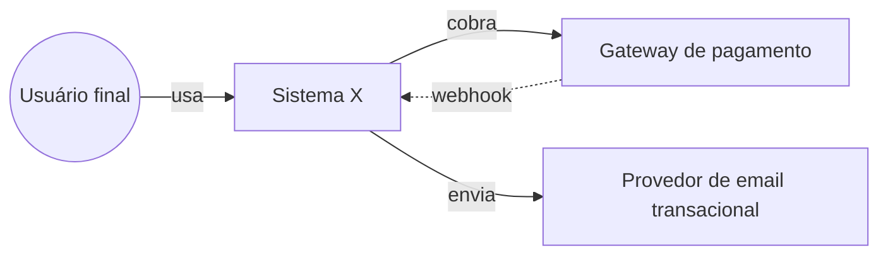
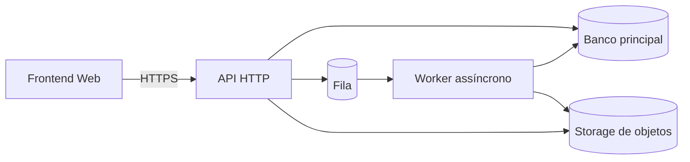

# Architecture overview

> Visão de alto nível do sistema. Decisões estruturais, padrões, e as fronteiras que definem como o software cresce sem virar bagunça.

## Princípios arquiteturais

1. _(ex.: módulos coesos, baixo acoplamento)_
2. _(ex.: domain-driven design onde regras de negócio justificarem)_
3. _(ex.: nada de microserviços antes de 100k usuários ativos)_
4. _(ex.: cada feature carrega seu próprio teste de integração ponta-a-ponta)_
5. _(ex.: dados de pagamento nunca passam pelo nosso backend — tokenizados no gateway)_

## Visão C4-lite

### Nível 1 — Contexto

> O diagrama abaixo é template. Edite ao preencher para o seu projeto. GitHub renderiza Mermaid nativamente.

Detalhar em [system-context.md](system-context.md).

### Nível 2 — Containers

Definir só depois de [technology-decision.md](technology-decision.md) estar pronta.

### Nível 3 — Componentes principais

Para cada container relevante, esboce 5–10 componentes:

| Container | Componente | Responsabilidade |
|-----------|------------|-------------------|
| API HTTP | AuthController | login, refresh, mfa |
| API HTTP | BillingService | gerar fatura, calcular comissão |
| Worker | EmailDispatcher | consumir fila e enviar via provider |

## Padrões adotados

| Padrão | Onde se aplica | Por que |
|--------|----------------|---------|
| Repository | Camada de dados | isolar ORM/SQL |
| Use case (application service) | Regras de negócio | testes unitários puros |
| Event-driven (selectivo) | Notificações e auditoria | desacoplar |
| Idempotência por chave | Operações de cobrança | evitar duplicidade |

## Padrões evitados

| Padrão | Por que evitar |
|--------|-----------------|
| Microserviços agressivos | overhead operacional sem ganho neste estágio |
| Event sourcing total | complexidade desproporcional ao domínio atual |

## Estratégias por preocupação

| Preocupação | Documento de detalhe |
|-------------|----------------------|
| Dados | [data-strategy.md](data-strategy.md) |
| Integrações externas | [integration-map.md](integration-map.md) |
| Escala | [scalability-strategy.md](scalability-strategy.md) |
| Observabilidade | [observability-strategy.md](observability-strategy.md) |
| Segurança | [../security/security-requirements.md](../security/security-requirements.md) |
| Deploy | [../deployment/deployment-strategy.md](../deployment/deployment-strategy.md) |

## Fronteiras de mudança

Onde estamos dispostos a refatorar grande quando o tempo pedir:

- _(ex.: trocar fila in-process por SQS quando volume > X)_
- _(ex.: separar marketplace em serviço próprio quando o domínio crescer)_

Onde **não** estamos dispostos a refatorar facilmente:

- _(ex.: schema de dados de cobrança — exige migração com cuidado)_
- _(ex.: contrato da API pública — versionamento estrito)_

## ADRs estruturais

Lista de ADRs que sustentam esta arquitetura (links para `docs/adr/`):

- ADR-0001 — escolha da linguagem principal
- ADR-0002 — banco de dados primário
- ADR-0003 — estratégia de autenticação
- _(continuar)_
