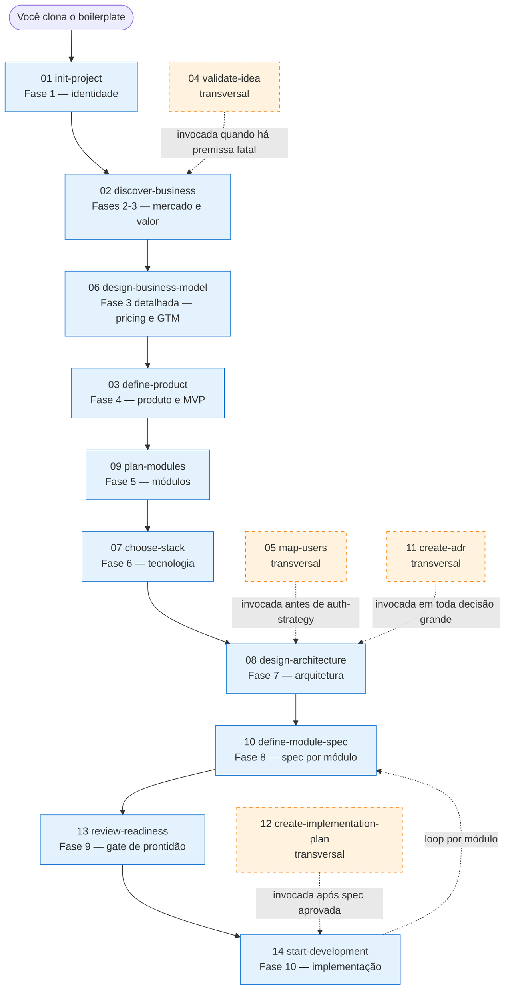

# Skills do `project-genesis-boilerplate`

> Documentação narrativa das 14 skills da mentoria. Para quem vai usar o boilerplate em um projeto novo e quer entender, em PT-BR claro, **o que cada skill faz, quando invocar, e o passo a passo que você (dev humano) executa**.

## O que é uma "skill" aqui

Skill é um **procedimento orientador** armazenado em `.claude/skills/<slug>/SKILL.md`. Ela é consumida pela IA (Claude Code) e, quando invocada, transforma o chat em uma sessão de mentoria conduzida — com perguntas, redirecionamentos, registros nos documentos certos e indicação da próxima skill.

Você invoca uma skill simplesmente **falando com a IA**. Não é comando técnico. Exemplos:

- "Vamos iniciar o projeto" → ativa `init-project`.
- "Quero escolher a stack" → ativa `choose-stack`.
- "Estamos prontos para implementar?" → ativa `review-readiness`.

A IA detecta a intenção pelos `description:` dos arquivos `SKILL.md` e carrega o procedimento certo.

> Esta pasta (`docs/skills/`) é a versão **para humanos** das skills. Os arquivos em `.claude/skills/` são otimizados para a IA. Os dois conjuntos contam a mesma história — escolha o lado que te ajuda mais em cada momento.

## Mapa do fluxo

Os blocos em azul formam o **tronco principal** do fluxo das 10 fases. Os blocos em laranja tracejado são **skills transversais** — você as invoca quando o contexto pede, não em uma fase específica.

## Tabela mestra

| # | Skill | Fase | Quando usar | Tempo típico |
|---|-------|------|--------------|---------------|
| 01 | [init-project](01-init-project.md) | 1 | Logo após clonar. Define identidade do projeto. | 30–60 min |
| 02 | [discover-business](02-discover-business.md) | 2–3 | Após init-project. Público, mercado, valor, monetização inicial. | 1–2 h |
| 03 | [define-product](03-define-product.md) | 4 | Após discover-business. Define produto, MVP e jornadas. | 1–2 h |
| 04 | [validate-idea](04-validate-idea.md) | transversal | Quando premissas fatais aparecem. | 30 min + dias de experimento |
| 05 | [map-users](05-map-users.md) | transversal | Antes da arquitetura, sempre que houver múltiplos papéis. | 30–60 min |
| 06 | [design-business-model](06-design-business-model.md) | 3 (detalhada) | Após discover-business, antes do MVP. Pricing e GTM. | 1–2 h |
| 07 | [choose-stack](07-choose-stack.md) | 6 | Após módulos definidos. Avalia ≥3 opções de stack. | 2–3 h |
| 08 | [design-architecture](08-design-architecture.md) | 7 | Após stack escolhida. C4-lite, integrações, dados, segurança. | 2–4 h |
| 09 | [plan-modules](09-plan-modules.md) | 5 | Após MVP definido. Identifica módulos do produto. | 1–2 h |
| 10 | [define-module-spec](10-define-module-spec.md) | 8 | Após arquitetura. Uma spec completa por módulo. | 1–2 h por módulo |
| 11 | [create-adr](11-create-adr.md) | transversal | Sempre que uma decisão importante surgir. | 15–30 min por ADR |
| 12 | [create-implementation-plan](12-create-implementation-plan.md) | transversal | Após cada spec aprovada. | 30–60 min por módulo |
| 13 | [review-readiness](13-review-readiness.md) | 9 | Antes da primeira linha de código. | 15–30 min |
| 14 | [start-development](14-start-development.md) | 10 | Apenas após readiness aprovado. | contínua, loop por módulo |

## Trilha recomendada

Sequência completa para um projeto novo. Use como checklist:

1. **Clone e prepare** — `bash scripts/genesis-init.sh meu-projeto`, abra o Claude Code dentro.
2. **Invoque [`init-project`](01-init-project.md)** dizendo *"vamos iniciar o projeto"*. Preenche identidade.
3. **Invoque [`discover-business`](02-discover-business.md)** — público, concorrência, valor.
4. **Invoque [`design-business-model`](06-design-business-model.md)** — planos, pricing, GTM.
5. **Invoque [`define-product`](03-define-product.md)** — visão de produto, MVP, jornadas.
6. **Checkpoint:** alguma premissa fatal? Se sim, invoque [`validate-idea`](04-validate-idea.md) antes de continuar.
7. **Invoque [`plan-modules`](09-plan-modules.md)** — quebra do produto em módulos.
8. **Checkpoint:** múltiplos papéis no produto? Invoque [`map-users`](05-map-users.md).
9. **Invoque [`choose-stack`](07-choose-stack.md)** — escolha tecnológica com ≥3 alternativas.
10. **Invoque [`create-adr`](11-create-adr.md)** para registrar a decisão de stack como ADR-0001.
11. **Invoque [`design-architecture`](08-design-architecture.md)** — visão de arquitetura, segurança, observabilidade, deploy.
12. **Para cada módulo crítico do MVP:**
    - **Invoque [`define-module-spec`](10-define-module-spec.md)** — spec completa.
    - **Invoque [`create-implementation-plan`](12-create-implementation-plan.md)** — quebra em tarefas.
13. **Invoque [`review-readiness`](13-review-readiness.md)** — gate de prontidão.
14. **Quando o gate liberar, invoque [`start-development`](14-start-development.md)** — começa a codar.

A IA vai sugerir explicitamente a próxima skill ao fim de cada uma. Você não precisa decorar essa lista — ela serve só pra dar visão geral.

## Skills transversais — o que são

Quatro skills não pertencem a uma fase específica. Você as invoca quando o contexto pede:

| Skill | Quando | Por quê |
|-------|--------|---------|
| [`validate-idea`](04-validate-idea.md) | Quando uma premissa crítica com confiança 1-2 e impacto alto aparece. | Validar antes de gastar tempo construindo é barato. |
| [`map-users`](05-map-users.md) | Sempre que houver múltiplos papéis (dono + admin + member + viewer + guest). | Alimenta `auth-strategy.md` e permissões dos módulos. |
| [`create-adr`](11-create-adr.md) | Toda decisão "irreversível em tempo curto" (stack, padrão arquitetural, fornecedor crítico, anti-decisão). | Sem ADR, decisão vira folclore. |
| [`create-implementation-plan`](12-create-implementation-plan.md) | Após cada spec de módulo aprovada, antes de codar. | TDD e commits pequenos exigem decomposição prévia. |

## FAQ

### Posso pular fases?

Não. A IA vai redirecionar. O motivo da estrutura existir é exatamente impedir que você comece a codar antes de entender o negócio. Se um item parecer irrelevante para o seu projeto (ex.: "não tenho marketplace, posso pular pricing de comissão?"), **registre essa decisão como ADR** e siga.

### E se eu já tenho stack escolhida?

Você ainda passa por [`choose-stack`](07-choose-stack.md). A mentora vai apresentar alternativas e te pedir para registrar a decisão como **decisão consciente** — não como hábito. Isso evita reescolher a stack por moda ou pressão futura.

### Como reabrir uma fase?

Edite o documento correspondente e atualize `docs/PROJECT_STATE.md` marcando a fase como "em revisão". Se a mudança altera contrato (stack, módulos, regras), crie ADR via [`create-adr`](11-create-adr.md) explicando o motivo.

### A IA pode escrever código antes do readiness aprovado?

Não. O hook `prevent-code-before-readiness.sh` bloqueia prompts de implementação, e `validate-docs-before-implementation.sh` bloqueia escrita de arquivos fora de `docs/`, `.claude/`, `templates/`, `tests/`, `scripts/` e `examples/`. Para emergências, exporte `GENESIS_HOOKS_DISABLE=1`.

### Onde estão os "anti-padrões" de cada skill?

No `SKILL.md` correspondente e na seção "Anti-padrões" da página de doc humana de cada skill. Estes são os comportamentos que a IA **não deve** fazer — se você notar a IA fazendo, lembre-a da regra ou registre como atrito em `tests/dogfood-tchr.md`.

### Como contribuir com melhorias nas skills?

1. Identifique o atrito (algo que travou ou confundiu).
2. Registre em `tests/dogfood-tchr.md` com severidade.
3. Atualize tanto `.claude/skills/<slug>/SKILL.md` (IA) quanto `docs/skills/<NN>-<slug>.md` (humano).
4. Rode `bash scripts/lint-docs.sh` para confirmar.
5. Abra PR.

## Onde olhar a seguir

- [START_HERE.md](../START_HERE.md) — guia de entrada do repositório.
- [PROJECT_STATE.md](../PROJECT_STATE.md) — painel de progresso atualizado vivo.
- [glossary.md](../glossary.md) — termos consistentes em PT-BR.
- [`tests/`](../../tests/) — sanity checks por skill.
- [`.claude/rules/`](../../.claude/rules/) — princípios aplicados automaticamente.
- [`.claude/agents/`](../../.claude/agents/) — agentes especializados que a mentora invoca para revisões profundas.
